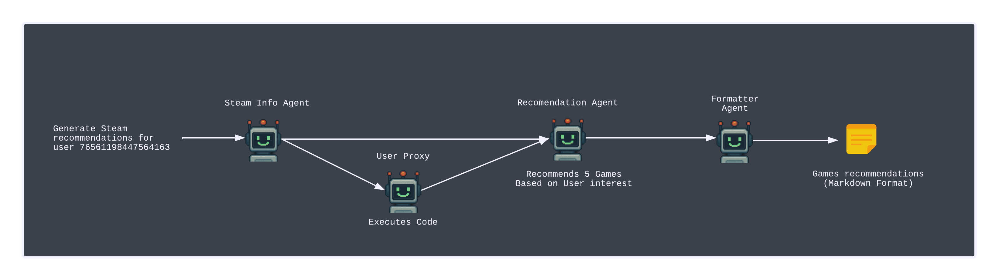

# Steam Sales Recommendation Agent

This script integrates multiple agents to gather current Steam sales and user data, generate game recommendations, and format them for output. It utilizes AG2, AWS Bedrock, and utility functions for Steam API interaction and web scraping.

## Agent Workflow



- **Agents and Tasks**:
  - `steam_info_agent`: Collects user's Steam games and current sales data.
  - `user_proxy`: executes `get_user_games` and `scrape_steam_games`
  - `recommendation_agent`: Analyzes data to recommend games based on playtime patterns and genre alignment.
  - `formatter_agent`: Formats recommendations into markdown for user-friendly display.

- **Functionality**:
  - Uses AWS Bedrock to access Anthropic's Claude-3.5 model for natural language processing tasks.
  - Retrieves user's Steam games and current sales information.
  - Generates personalized game recommendations based on gathered data.


See an example of a succesfull execution -> [Recomendation Example](./recomendation.md)

## Setup
> [!WARNING]  
> Important Notes
- This project is not actively maintained and may not work out of the box if cloned or copied. (last test was 13/04/2025)

- The scraping function may not work in all regions — be aware of your geographic location when running the code. (was tested in `us-east-1` and `eu-west-1`, also some local executions from `Colombia`)

- Since web scraping is used, Steam sales data and related functions may break if steam updates their HTML structure.

1. Clone this repository or download the script.

2. Create a virtual environment and activate it:

   ```sh
   python -m venv venv
   source venv/bin/activate  # On macOS/Linux
   venv\Scripts\activate  # On Windows
   ```

3. Install dependencies:

   ```sh
   pip install -r requirements.txt
   ```

4. **Configuration**:
   - Set up environment variables in a `.env` file:

     ```sh
     STEAM_API_KEY=your_steam_community_api_key
     AGENTOPS_API_KEY=your_agentops_api_key # only if you want to test agentops integration in ./concepts/agentops_handler.py
     AWS_ACCESS_KEY=your_aws_access_key
     AWS_SECRET_KEY=your_aws_secret_key
     ```

5. **Usage**:
   - Run the script:

     ```sh
     python flask_app.py
     ```

   - Send a GET request like this make sure to add `steam_id` and `count` params:
     - `count` param will be the number of games the agent will retieve from user's profile

     ```sh
     http://localhost:5000/api/recommendations?steam_id=76561198447564163?count=15
     ```

   - You can also try some concepts files located in [/concepts](./concepts)

## 🌐 Resources

[AG2](https://ag2.ai/) - Open-source platform for building, orchestrating, and deploying production-ready AI agents

[AWS Bedrock](https://aws.amazon.com/bedrock/) - Cloud service for accessing foundation models, including Claude 3.5 by Anthropic.

[Steam API libary](https://github.com/deivit24/python-steam-api) - A Python wrapper for interacting with the Steam API.

[Scrapper Docs](https://www.youtube.com/watch?v=oKk3dplKLVg&t=1476s&pp=ugMICgJlcxABGAHKBQ5zdGVhbSBzY3JhcHBlcg%3D%3D) - YouTube video guide on building a Steam web scraper.

[Agentops](https://docs.agentops.ai/v1/integrations/autogen) - Documentation for integrating AgentOps with the AutoGen framework.
